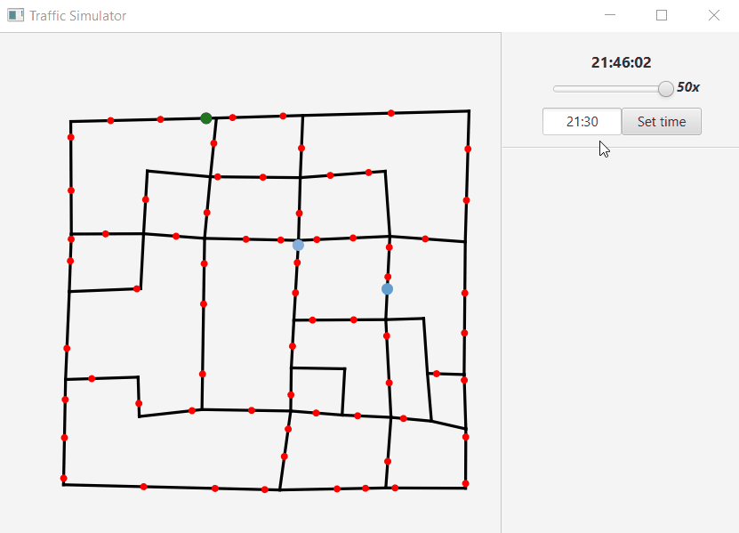

# IJA project
Author: Martin Koči (xkocim05), Michal Koval(xkoval17)

This project is simple traffic simulator.
What is does is loading data with jackson library into objects. Then it renders map and start the simulation in current time.


In terminal you can build project with
```
ant compile
```
and then run in with
```
ant run
```

##Time shift and time speed
You can proceed time shift and change time speed.


##Connection and line info
When you click on connection u can see its delay and on with line is going on.


##Traffic and delay
You can change traffic and see delay in street info panel

